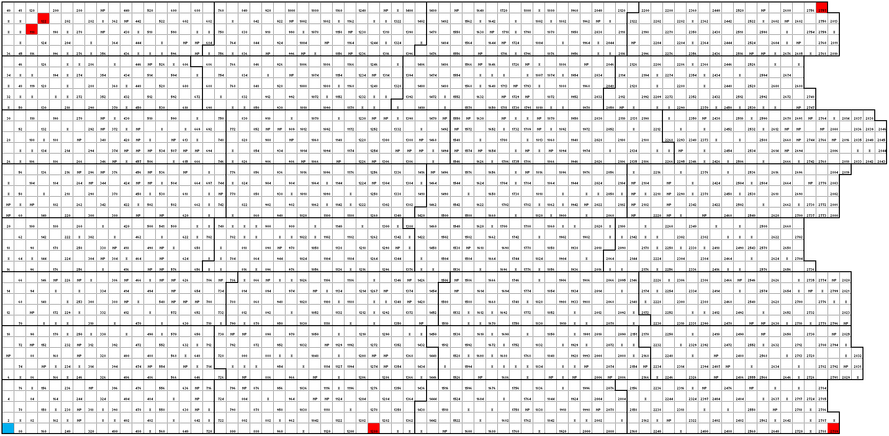
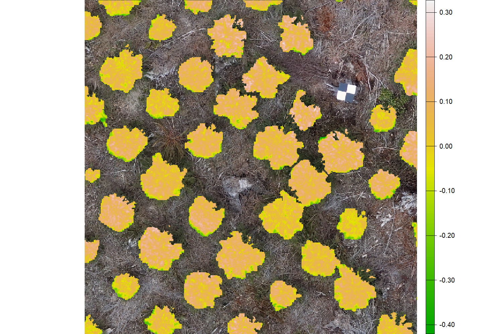
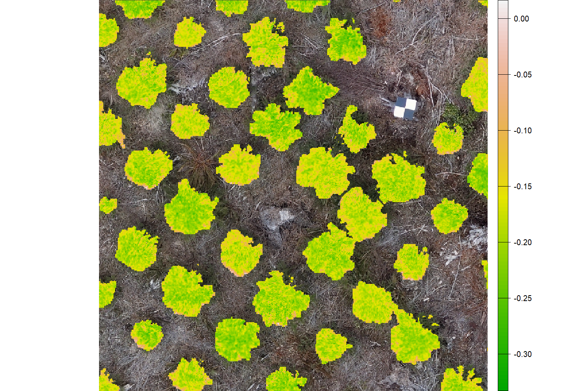
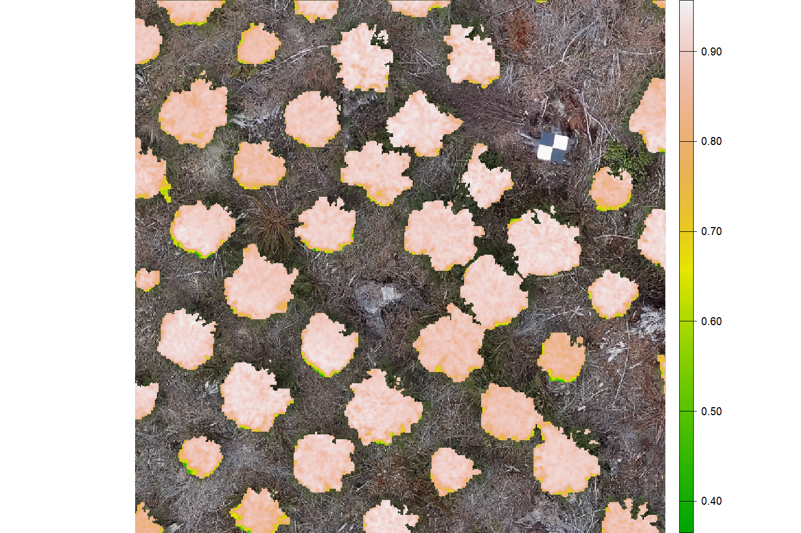
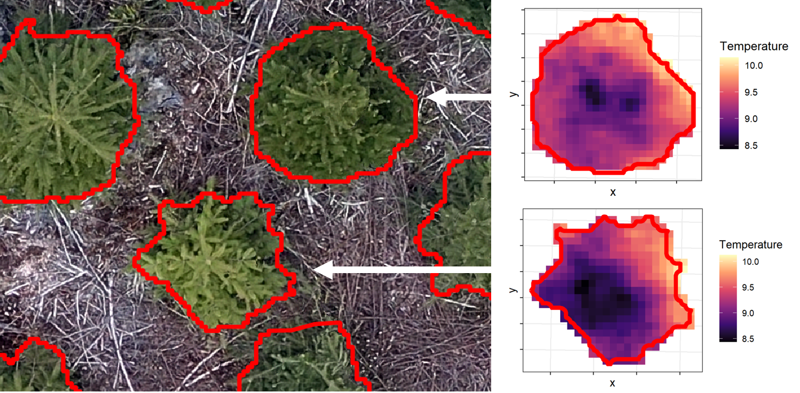

# Introduction

```{=html}
<div class="slideshow-container">

  <div class="mySlides fade">
    
    <div class="slide-title">Traditional Spreadsheet Map</div> <!-- Title for the slide -->
  </div>

  <div class="mySlides fade">
    
    <div class="slide-title">High Res RGB</div>
  </div>

  <div class="mySlides fade">
    
    <div class="slide-title">Georeferenced treetops</div>
  </div>
  
  <div class="mySlides fade">
    
    <div class="slide-title">Delineated crowns: mature Douglas fir</div>
  </div>
  
    <div class="mySlides fade">
    
    <div class="slide-title">Juvenile Western redcedar</div>
  </div>
  
      <div class="mySlides fade">
    
    <div class="slide-title">Juvenile Douglas fir</div>
  </div>
  
        <div class="mySlides fade">
    
    <div class="slide-title">10 band multispectral</div>
  </div>
  
   <div class="mySlides fade">
    
    <div class="slide-title">LiDAR point clouds</div>
  </div>

        <div class="mySlides fade">
    
    <div class="slide-title">NIR Mask</div>
  </div>
  
  <div class="mySlides fade">
    
    <div class="slide-title">Vegetative Index: CCI</div>
  </div>
  
    <div class="mySlides fade">
    
    <div class="slide-title">Vegetative Index: PRI</div>
  </div>
  
      <div class="mySlides fade">
    
    <div class="slide-title">Vegetative Index: NDVI</div>
  </div>
    
      <div class="mySlides fade">
    
    <div class="slide-title">Thermal</div>
  </div>
  
</div>

<div class="text-container">

<h2>Abstract</h2>
<p>There is significant potential for broad deployment of scalable drone-mounted remote sensing technologies in forestry. For example, forest genetics programs rely on large-scale phenotyping of individual trees throughout pre-selection, selection, and post-selection to inform seed choices that will promote resilient, productive forests. However, the number of sites and trees within sites that can be phenotyped is often constrained by the time and cost of labour. As climate change intensifies environmental stress for forest trees and forestry policies shift towards a focus on climate adaptation, there is increased need for efficient and cost-effective data collection methods to measure key phenotypic traits relating to climate adaptation and resilience. Drone-mounted sensors can be used to quantify a range of standard phenotypic data (i.e. height) and novel traits (i.e. vegetation indices) with data captured over entire trials within hours.</p>

<p>The information and workflows in this guide are informed by a collaborative project. Our team included the University of British Columbia (UBC), Natural Resources Canada (NRCan) and the BC provincial Ministry of Forests (MOF). The project objective was to use remote sensing tools to better understand how trees respond to climatic stressors by analyzing phenotypic (i.e. spectral indices and structural metrics) and genetic correlations at the tree level to guide genetics programs in the selection of trees better able to cope with future climates.</p>

<p>This guide is intended as a resource for the forestry community interested in incorporating remote-sensing tools for phenotyping. While this platform was built on gridded forest genetics trials, the data collection and processing on any gridded forest research trial capturing individual tree data would essentially remain the same. This guide covers ideal site selection for the remote sensing tools, flight preparations, equipment considerations and parameters, data management, step-by-step LiDAR and photogrammetric (multispectral and RGB imagery) workflows, tree georeferencing and crown delineation workflows, and a breakdown of equipment cost. All workflows are illustrated step-by-step with example images and code. This information has been published as a living bookdown document to allow for updates and the incorporation of edits by readers. It is designed to be a start to finish workflow with the final product being individual tree metrics and vegetation indices for analysis.</p>

<p>See the index for a more detailed breakdown of the information provided</p>

<h2>Background and Basis of Knowledge</h2>
<p>In Canada and other countries with managed forest industries, operational forestry includes reforestation of harvested or naturally deforested land. In many widespread forest tree species, populations are locally adapted to their climates of origin, meaning that jurisdictions must determine which seed sources can be used in which environments to ensure the health and productivity of planted forests. These decisions are made using common-garden trials, experiments which test different genotypes in a common environment to isolate the genetic component of their physical traits, or phenotype.  For many decades, measurements of height and diameter have been used to identify desirable genotypes for a given environment, in other words, the trees that grow tallest in a climate represent the best seed sources to plant in that climate. 
However, the measurement of traits in common-garden trials, or phenotyping, represents a bottleneck in forest genetics because (1) it is time-consuming and expensive to phenotype thousands of large trees in remote field environments, and (2) simple traits of height and diameter may not capture signals of adaptation and resilience. Drone remote sensing technology has the potential to alleviate the forest genetics phenotyping bottleneck through (1) more efficient phenotyping of traditional target traits representing height and diameter growth, and (2) novel traits, such as spectral vegetation indices, representing foliar physiology and responses to stress.</p>
 
<p>In the western Canadian province of British Columbia (BC), where this research took place, remote sensing tools provide the opportunity for hundreds of forest genetics trials to be assessed for traditional traits like tree size and for novel climate-adaptive traits and tree health assessments. However, before these powerful tools can be adopted, their suitability in different environments must be assessed (i.e. sloped verse flat terrain, open canopy verse crown-closure, etc.).</p>  
 
<p>Over 2022 and 2023 we conducted more than 400 flights on six MOF forest genetics research trials collecting multispectral, LiDAR and thermal data. The six trials, located in two regions near Jordan River and Powell River in coastal BC, represent cool-moist and dry-warm coastal environments. Our repeated field campaigns over two years allowed us to capture several biologically relevant climatic windows, including heat and drought events, and to look at practical considerations on applying these tools by including two morphologically different conifer species at pre-selection and mature ages.  As the project continues into 2024, the methodology will be further refined on new sites and updated throughout this guide.</p>

<p>These guidelines were developed using drone-acquired data collected on forest genetics field trials known as progeny trials. Progeny trials involve crossing specific parent trees and testing offspring in replicated trials across a wide geographic area. Due to known parent-offspring relationships and family structures, it is possible to infer the heritability of a trait, or the proportion of phenotypic variance attributable to transmissible genetic variance. This information is key for forest geneticists since the gains from genetic selection rely on trait heritability and variability (selection intensity). Knowledge of relatedness also makes it possible to infer the value of parent trees and offspring for future crosses for the trait, known as breeding values. Evaluating the correlation of genetic variations among traits is another important component in tree breeding since positive genetic correlations may allow simultaneous selection for two desirable traits (indirect selection) while negative genetic correlations require special treatment to mitigate trade-offs. It is also critical to understand how tree genotypes’ responses vary across environments (genotype-by-environment interactions), since stability of trait expression affects tree breeding and seed deployment.</p>
</div>

<script>
let slideIndex = 0;
showSlides();

function showSlides() {
  let slides = document.getElementsByClassName("mySlides");
  for (let i = 0; i < slides.length; i++) {
    slides[i].style.display = "none";
  }
  slideIndex++;
  if (slideIndex > slides.length) {slideIndex = 1}
  slides[slideIndex-1].style.display = "block";
  setTimeout(showSlides, 3000); // Change slide every 3 seconds
}
</script>

<!-- Below added for format by OW -->

<style>
.slideshow-container {
  max-width: 1000px;
  height: 50vh; /* Take up half of the screen */
  position: relative;
  margin: hidden;
}

.mySlides {
  display: none;
  height: 100%;
}

img {
  vertical-align: middle;
  height: 100%;
  width: 100%;
}

.text-container {
  height: 50vh; /* Bottom half of the screen */
  overflow-y: auto; /* Allows scrolling through text if necessary */
  padding: 20px;
  font-family: Arial, sans-serif;
}

/* Slide title (caption) styling */
.slide-title {
  position: absolute;
  bottom: 8px;
  left: 16px;
  color: white;
  font-size: 20px;
  font-family: Arial, sans-serif;
  background-color: rgba(0, 0, 0, 0.5); /* Semi-transparent black background */
  padding: 8px;
  border-radius: 4px;
}


body {
  margin: 0;
  padding: 0;
}

/* Animation for fade effect */
.fade {
  animation-name: fade;
  animation-duration: 1.5s;
}

@-webkit-keyframes fade {
  from {opacity: .4} 
  to {opacity: 1}
}

@keyframes fade {
  from {opacity: .4} 
  to {opacity: 1}
}

.dot {
  height: 15px;
  width: 15px;
  margin: 0 2px;
  background-color: #bbb;
  border-radius: 50%;
  display: inline-block;
  transition: background-color 0.6s ease;
}

.active {
  background-color: #717171;
}
</style>
```
